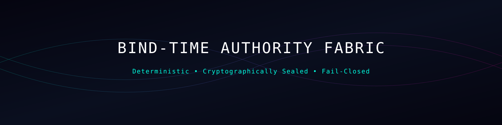
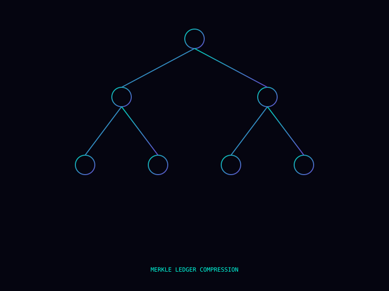
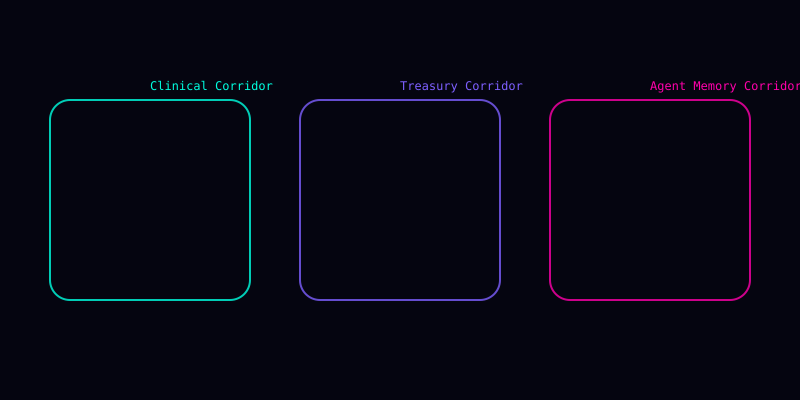
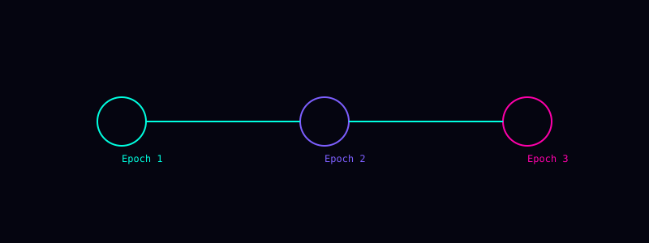

<p align="center">
  
</p>

<p align="center">
  
  
  
  
  
</p>

# Bind-Time Authority Proof

Protected proof surface for bind-time authority validation.

This repository demonstrates the public-safe principle that execution permission does not persist by default.

```text
Standing must be evaluated at the moment consequence would bind.
```

## Live Public Sandbox

**[Open the Bind-Time Authority interactive sandbox](https://kamanaka5502.github.io/bind-time-authority-proof/)**

The browser surface allows a reviewer to revoke authority, advance epochs, reissue standing, mutate the bounded public proof chain, attempt bind, and replay identical state to observe deterministic decision posture. It is a public-safe demonstrator only; the protected runtime remains undisclosed.

---

## Disclosure Boundary

This repository is **not** the production authority fabric.

It does not disclose or license:

- production authority evaluator
- production key-management architecture
- private signing infrastructure
- private standing-token format
- private corridor implementation
- protected runtime law
- customer-specific authority policy
- production ledger implementation
- commercial deployment architecture

Any runnable code in this repository must be treated as a bounded demonstrator, not the protected implementation.

---

## Core Thesis

Execution permission does not persist.

Authority may be valid at request time and invalid at bind time.

The protected question is:

```text
Does this action still have authority at the exact boundary where consequence would become real?
```

If standing cannot be proven at that boundary, execution must refuse.

---

## Visual Surfaces

<p align="center">
  
</p>

<p align="center">
  
</p>

<p align="center">
  
</p>

---

## Public Demonstrator Model

The public demonstrator may show:

- bind-time authority posture
- epoch change / reissue concept
- refusal when authority is stale
- deterministic replay posture
- bounded receipt or chain summaries
- fail-closed behavior

The public demonstrator must not be interpreted as production cryptography, production key lineage, production ledger design, or a complete authority-control implementation.

---

## Invariants

**I1 — Bind-Time Authority Check**  
Authority mismatch at commit forces `REFUSE`.

**I2 — Deterministic Replay**  
Identical public demo state produces identical decision posture.

**I3 — No Resurrection Without Reissue**  
Authority cannot recover implicitly after revocation.

**I4 — Mutation Detectability**  
Unexpected chain mutation must be detectable in the demonstrator.

---

## Security Posture

Fail closed by default.

If authority cannot be proven at the consequence boundary, execution does not proceed.

---

## Use Boundary

This repository is proprietary / restricted-use material.

Viewing this repository does not grant permission to copy, reuse, reverse engineer, clone, derive from, commercialize, or deploy the architecture, runtime logic, authority model, receipt model, replay model, or execution-boundary system.

Production review requires a separate written agreement.

---

<p align="center">
  
  
</p>
